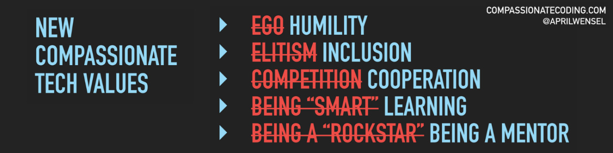

# Hello there 👋 I'm Sophie. 

 I'm a french developer who love <b>Front-End developement</b> and <b>Javascript</b>. I had experiences with <b>HTML/CSS/JS</b> and <b>CMS</b> (WordPress, Plone, Prestashop, Jalios).

 I search for a remote job to collaborate with an international team to grow with passionates people.

💻 I’m working in my day job with JCMS (jalios).

🔭 I’m currently learning <b>React with redux</b> and <b>React Native</b>.

🌱 On my "to learn" list next: Node (with React), Typescript... 

🤠 Off topics facts about me : I had an art history and archeologia degree and I am a big fan of Pixar movies.  

🖌️ To learn more about me, you can see my <b>developer resume</b> on my *[Portfolio](https://sophie-marchand.netlify.app/Resume)*.

📫 How to reach me: on my *[portfolio](https://sophie-marchand.netlify.app/Contact)*, on *[Twitter](https://twitter.com/S0f1eM)* or *[Linkedin](https://www.linkedin.com/in/sophie-marchand-web-developer/)*. 

